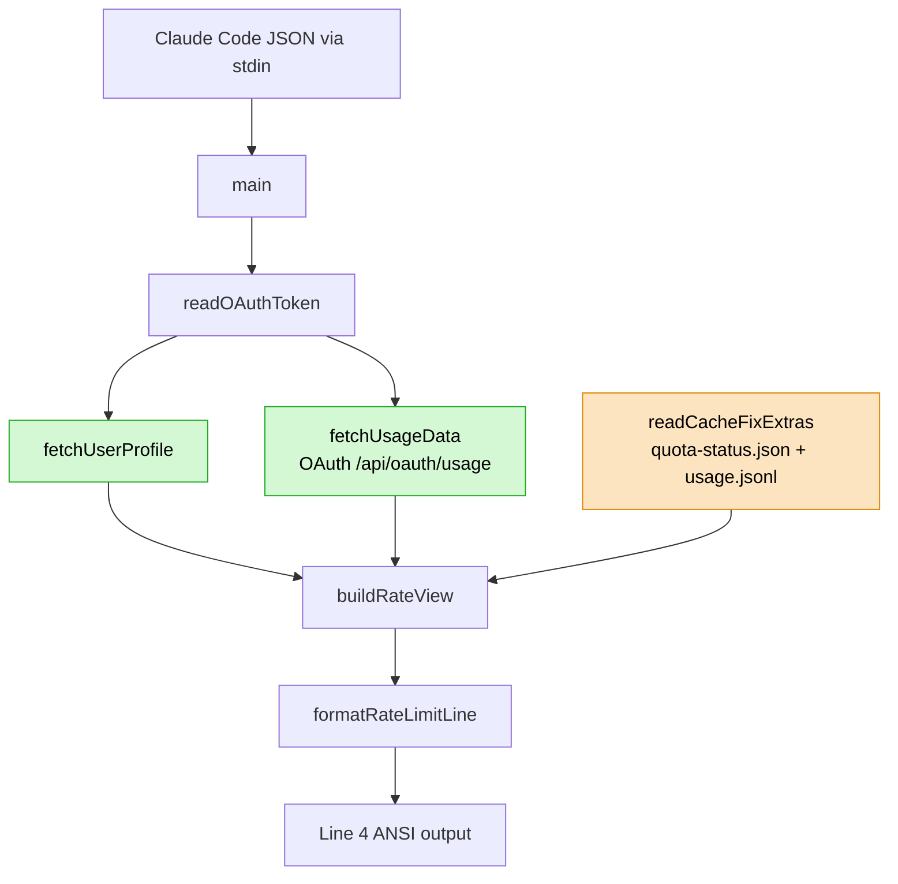

# Rate-Limit Module Refactor — Architecture (v4.6.1)

## 1. Application Type & Context

**Type:** CLI utility module (Node.js), scope of refactor = single subsystem inside `scripts/statusline.js`.
**Detection rationale:** not a new project; existing `contextbricks-universal` is a cross-platform
Node.js statusline that reads stdin JSON from Claude Code and writes ANSI-colored lines to stdout.
This document covers the **Line 4 rate-limit subsystem** only — pure functions invoked once per
statusline render (sub-300ms budget).

**Driver of refactor:** regression of the original v4.5.0 intent. The goal was "inline the
claude-code-cache-fix algorithms into our code" — merge/pacing/burn-rate computation — not
"depend on cache-fix as the primary data source for 5h/7d". v4.5.0 accidentally gave cache-fix
files priority over OAuth API for session/week utilization, which fails when cache-fix is stale
or disabled (current real bug: user sees `w:13%` instead of `45%` because cache-fix frozen 39h).

## 2. Architecture Diagram



Legend: green = authoritative data source (5h/7d/sub-limits/design/extras_usage),
orange = optional enhancement (TTL/hit-rate/PEAK/OVERAGE only).

## 3. Component Map

| Component | Responsibility | Dependencies | Owner Layer |
|-----------|----------------|--------------|-------------|
| `fetchUsageData` | GET OAuth `/api/oauth/usage`, cache in `.usage-cache.json` (TTL 180s, stale-while-error 5h) | `spawnSync(node -e)`, token | Infrastructure |
| `fetchUserProfile` | GET OAuth `/api/oauth/profile`, 24h cache invalidated on credentials mtime | `spawnSync`, token | Infrastructure |
| `readCacheFixExtras` *(renamed from `readCacheFixQuota`)* | Read **extras only** (TTL/hit/PEAK/OVERAGE) from `quota-status.json`; apply **staleness gate** (`ts > 30min → return null`) | fs | Infrastructure |
| `computePacing` | Compute expected % for elapsed-time-in-window; pure | — | Domain |
| `computeBurn` *(new, extracted)* | Compute burn rate `pct/elapsed_min(or hr)`; suppress when `elapsed ≤ 1min` or `pct ≤ 0`; pure | — | Domain |
| `buildRateView` *(renamed from `mergeRateData`)* | Compose semantic view `{session, week, sonnet, opus, design, extras, extra_usage}` from OAuth + (optional) cache-fix extras; pure | `computePacing`, `computeBurn` | Use Case |
| `buildLimitSegment` | Render one segment (`session:31%/42% +0.4/m ~3h43m`) with colors/labels/degradation flags; pure | color utils | Presentation |
| `formatRateLimitLine` | Full Line 4 composition with 10-step graceful degradation based on terminal width; pure | `buildLimitSegment` | Presentation |

**Removed from current codebase:**
- `mergeRateData` cache-fix priority branches for 5h/7d (lines 566–601).
- `org-id gate` (`cannotVerify`, `orgMismatch`, `cfRejected`) — no longer needed since cache-fix cannot influence user-visible utilization values.
- `q5h_reset/q7d_reset` future-reset gate for cache-fix quota (deleted alongside the quota fields).

## 4. Layer Boundaries

- **Entry:** `main()` reads stdin, parses session JSON, composes 4 lines. No business logic.
- **Infrastructure:** `fetchUsageData`, `fetchUserProfile`, `readCacheFixExtras` — all I/O with explicit freshness policy (TTL, staleness gate, stale-while-error). Out of scope for pure tests.
- **Domain (pure):** `computePacing`, `computeBurn`, `formatResetTime`, `getColorForUtilization`. Mockable via unit tests without filesystem.
- **Use Case (pure):** `buildRateView(oauthData, cfExtras)` — takes two read-only inputs, emits a semantic view. No I/O, no `Date.now()` hidden dependencies (passed in as `nowMs`).
- **Presentation (pure):** `buildLimitSegment`, `formatRateLimitLine` — takes a semantic view + a width budget, emits ANSI string.

**Dependency rule:** Domain ← Use Case ← Presentation ← Entry. Infrastructure injected at Entry only. This was violated in v4.5.0 — `mergeRateData` read `Date.now()` twice (`nowMs` vs `realNowMs`) and made freshness decisions based on implicit system clock. New design injects both as parameters.

## 5. Data Flow

### Happy path

```
stdin JSON
  → readOAuthToken (from ~/.claude/.credentials.json or macOS keychain)
  → parallel:
      fetchUserProfile (profile cached 24h, org.uuid read for future use)
      fetchUsageData   (OAuth /api/oauth/usage, cache 180s)
      readCacheFixExtras (quota-status.json → {ttl, hit, peak, overage} IF ts < 30min ELSE null)
  → buildRateView(oauthData, cfExtras, nowMs)
      session  ← oauthData.five_hour          + computePacing + computeBurn
      week     ← oauthData.seven_day          + computePacing + computeBurn
      sonnet   ← oauthData.seven_day_sonnet   + computePacing
      opus     ← oauthData.seven_day_opus     + computePacing
      design   ← oauthData.seven_day_omelette + computePacing
      extras   ← cfExtras (or empty if gated out)
      extra_usage ← oauthData.extra_usage (if is_enabled:true)
  → formatRateLimitLine(merged, termWidth)
      step through 10-level degradation chain until fits in termWidth
  → ANSI string to stdout (Line 4)
```

### Error / degraded paths

| Failure | Response | User sees |
|---------|----------|-----------|
| OAuth API 200 but empty fields | no session/week entries | Line 4 empty (gracefully) |
| OAuth API 429 / timeout | stale-while-error cache (up to 5h), `expireResetLimits` zeroes expired windows | last known values |
| `.usage-cache.json` missing on first run + API fails | `null` | Line 4 empty |
| `quota-status.json` stale (>30min) | `readCacheFixExtras` returns `null` | No TTL/hit/PEAK — rest intact |
| `quota-status.json` missing | `readCacheFixExtras` returns `null` | Same as above |
| `usage.jsonl` present but `claude-meter.jsonl` missing | Ignored (wrong format, not our source) | Same as above |
| OAuth token missing / logged out | No fetch | Line 4 empty |

## 6. Deployment Strategy

No change. Distributed via `npm install -g contextbricks-universal`. Single-process, single-invocation,
sub-second runtime per render. No background services, no persistent state beyond cache files with
mode 0o600 in `~/.claude/`.

## 7. Reusability Awareness

Evaluated every component in §3:
- `computePacing`, `computeBurn`, `formatResetTime`, `getColorForUtilization` — candidate utilities,
  but **Rule of Three** fails: used only inside this module, no second consumer in sight. Do NOT
  extract.
- `buildLimitSegment` — tightly coupled to ANSI color constants + degradation flags specific to
  statusline. Not a library candidate.
- `fetchUsageData` / `fetchUserProfile` — Anthropic OAuth–specific; would be candidates only if a
  second tool in this workspace needed OAuth usage data. None exists.

**Candidates emitted this invocation:** none. Not a protocol violation — questions were asked for
every component and answered "no candidates" (see `references/reusability-candidates.md`).

## 8. Domain Modeling

DDD evaluated — **not needed**. This is a pure-function pipeline (no aggregate roots, no bounded
contexts, no identity-bearing entities). The only nouns are `Usage`, `Profile`, `Extras`, `Segment`
— all are read-only data shapes, not domain entities. One-way dataflow, no state transitions.

## 9. ADRs

### ADR-001: OAuth is the single source of truth for 5h/7d/sonnet/opus/design
**Status:** Accepted
**Context:** v4.5.0 made cache-fix files authoritative for 5h/7d utilization. This broke when
cache-fix stopped writing (current situation: 39h of staleness produces `w:13%` vs real `45%`).
Original intent was "inline the algorithms", not "take the data".
**Decision:** 5h/7d/sonnet/opus/design always read from OAuth `/api/oauth/usage`. Cache-fix cannot
override these fields.
**Consequences:** Easier: single data path, no merge conflicts, no cross-account gate, no staleness
surprise. Harder: lose cache-fix's per-request freshness for 5h/7d (OAuth has 180s TTL vs cache-fix's
per-request write). Accepted tradeoff — human reads statusline on a minutes-scale.
**Reversibility:** REVERSIBLE — can reintroduce cache-fix priority later behind a new opt-in flag
if justified.

### ADR-002: Cache-fix limited to extras (TTL / hit rate / PEAK / OVERAGE)
**Status:** Accepted
**Context:** These four fields are NOT in OAuth API responses. Cache-fix is the only source.
**Decision:** `readCacheFixExtras` returns only these four fields (plus `ts` for staleness gate).
All quota fields (`q5h`, `q7d`, resets) are removed from its return shape.
**Consequences:** Easier: clear responsibility, no overlap with OAuth. Harder: if cache-fix stops
writing, these indicators disappear — users lose visibility into cache hit rate. Accepted.
**Reversibility:** REVERSIBLE.

### ADR-003: Staleness gate on cache-fix at 30 minutes
**Status:** Accepted
**Context:** Cache-fix writes `quota-status.json` once per intercepted API request. If Claude Code
idles, the file stays fresh only for the last request; if Claude Code crashes or cache-fix is
disabled, the file freezes indefinitely. Needed a bound.
**Decision:** If `ts` from `quota-status.json` is older than 30 minutes, return `null`. Rationale:
an active Claude Code session typically fires at least one request per few minutes; 30 minutes
leaves wide headroom for legitimate idle while still catching "cache-fix is dead".
**Consequences:** Easier: bounded staleness, predictable degradation. Harder: edge case where user
has Claude Code open but idle for >30min — extras disappear. Acceptable — returns on first new
request.
**Reversibility:** REVERSIBLE — threshold is a single constant.

### ADR-004: Remove org-id cross-account gate
**Status:** Accepted
**Context:** v4.5.0 added `expectedOrgId` gate because cache-fix data could leak across accounts
after relogin (different org showed previous org's numbers). With OAuth now authoritative for all
quota values, cache-fix extras (TTL / hit / PEAK / OVERAGE) are organization-independent:
TTL=5m/1h and PEAK are per-request flags, not quota state. Leakage risk drops from "wrong
percentage" to "possibly wrong TTL tier for one render cycle" — acceptable.
**Decision:** Delete `expectedOrgId` parameter from `buildRateView`, delete `cfRejected` field,
delete `_extras.org_id` read path.
**Consequences:** Easier: ~20 lines removed, cleaner signatures, one less test surface. Harder:
theoretical edge case where extras from prior org leak for one render — acceptable.
**Reversibility:** REVERSIBLE.

### ADR-005: Pure functions take `nowMs` as a parameter
**Status:** Accepted
**Context:** v4.5.0 `mergeRateData` called `Date.now()` twice — `nowMs` (anchored to cfData.ts)
and `realNowMs` (system clock). Hidden time dependency caused pacing bugs during Gemini review.
**Decision:** `buildRateView`, `computePacing`, `computeBurn` all take `nowMs` as a required
parameter. No internal `Date.now()` calls. Entry layer (`main`) captures `Date.now()` once and
passes it everywhere.
**Consequences:** Easier: deterministic unit tests without time mocking, no time-skew bugs.
Harder: minor call-site noise.
**Reversibility:** REVERSIBLE.

## 10. Selected Patterns with Rationale

- **Single-pass pipeline:** stdin → pure transforms → stdout. No mutation, no shared state. Matches
  CLI utility constraints.
- **Dependency injection at entry:** `nowMs`, `termWidth`, `oauthData`, `cfExtras` all injected
  into `buildRateView` / `formatRateLimitLine`. Enables fixture-driven tests (`_mock_profile`,
  `_mock_cache_fix` on stdin) without filesystem.
- **Stale-while-error (retained):** OAuth cache keeps serving up to 5h old data on API failure +
  3-min error backoff. Proven in v4.4.0, no change.
- **Graceful degradation (retained):** 10-step fallback chain matches terminal width. No change to
  the algorithm; the only change is what segments feed into it.

## 11. Open Questions

- **Q1:** Do we want a fallback for cache-fix extras when `quota-status.json` is stale but
  `usage.jsonl` has fresh per-request records? `usage.jsonl` format includes `q5h_pct`, `q7d_pct`,
  `ttl_tier`, `peak_hour`, but is not currently read. **Decision:** defer to v4.7.0 if the user
  requests it. Adds complexity (tail-parsing a 10MB file) for marginal value given OAuth covers the
  quota side.
- **Q2:** Should `CONTEXTBRICKS_SHOW_CACHE_FIX=0` still exist, given cache-fix only contributes
  extras now? **Decision:** yes — semantics shift from "OAuth-only mode" to "disable extras" but
  the env var stays for backward compatibility. Update docs.
- **Q3:** Should the staleness threshold be configurable (env var) or a fixed 30 min? **Decision:**
  fixed constant for now (simpler); extract to `const CACHE_FIX_MAX_AGE_MS` so a future env var
  hook is trivial.

## 12. Handoff

Architecture complete. Next step: turn this into a feature contract via `/nvmd-specify` — covering
FR list (remove cache-fix priority for 5h/7d; add staleness gate; keep extras only), NFR
(test-coverage, perf budget, terminal-width degradation), and edge cases (idle >30min,
cache-fix missing entirely, OAuth 429 + stale cache-fix).

Release target: **v4.6.1** (patch — no new features, pure regression fix + simplification).
Branch: worktree `feat/v4.6.1-oauth-authoritative` → PR → code review → merge → release workflow
auto-publishes to npm with provenance.
